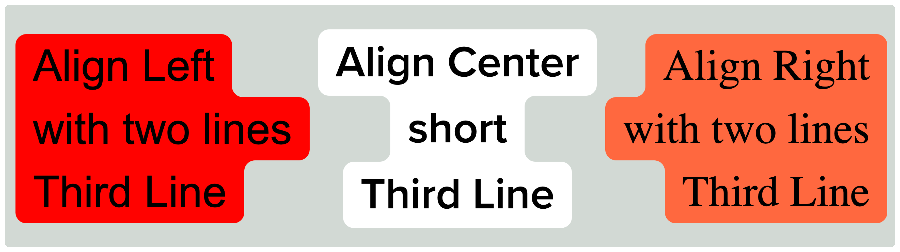

#  TikTok Text Box Component for React

Based on the work of [Josiah Winslow](https://hachyderm.io/@winslowjosiah/110189337913069219) posted on [Hachyderm](https://hachyderm.io/@winslowjosiah/110189337913069219).

---
`<TikTokTextBox>` is a React component that mimics the TikTok text box style. This was designed to be used with [Remotion](https://github.com/remotion-dev/remotion), but can be used with any React project.



```jsx
<TikTokTextBox lines={["Align Left", "with two lines", "Third Line"]} align="left" fontFamily="Arial" bgColor="red" />

<TikTokTextBox lines={["Align Center", "short", "Third Line"]} align="center" fontFamily="Proxima Nova Semibold" />

<TikTokTextBox lines={["Align Right", "with two lines", "Third Line"]} align="right" bgColor="#FF683E" textColor="black" />
```